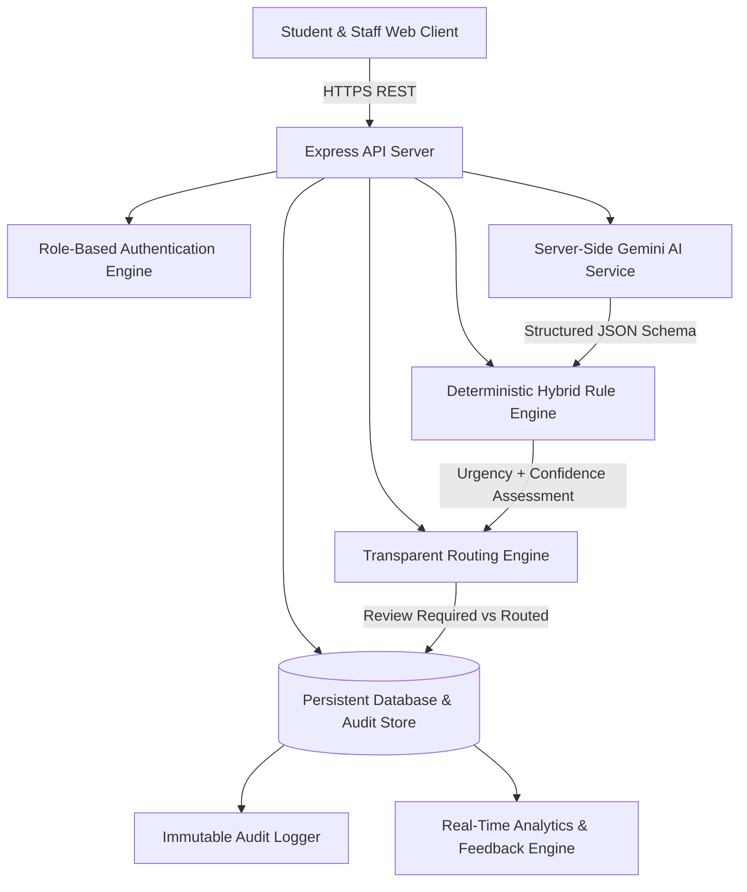
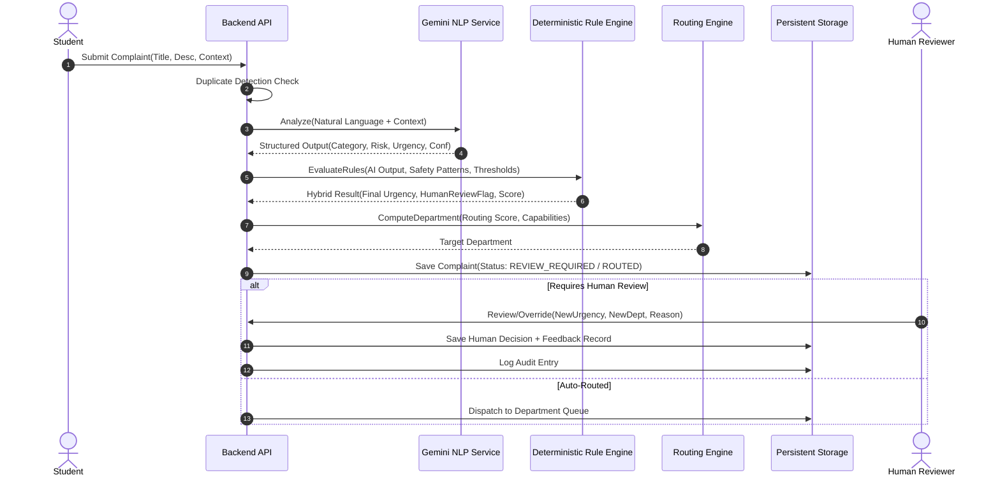
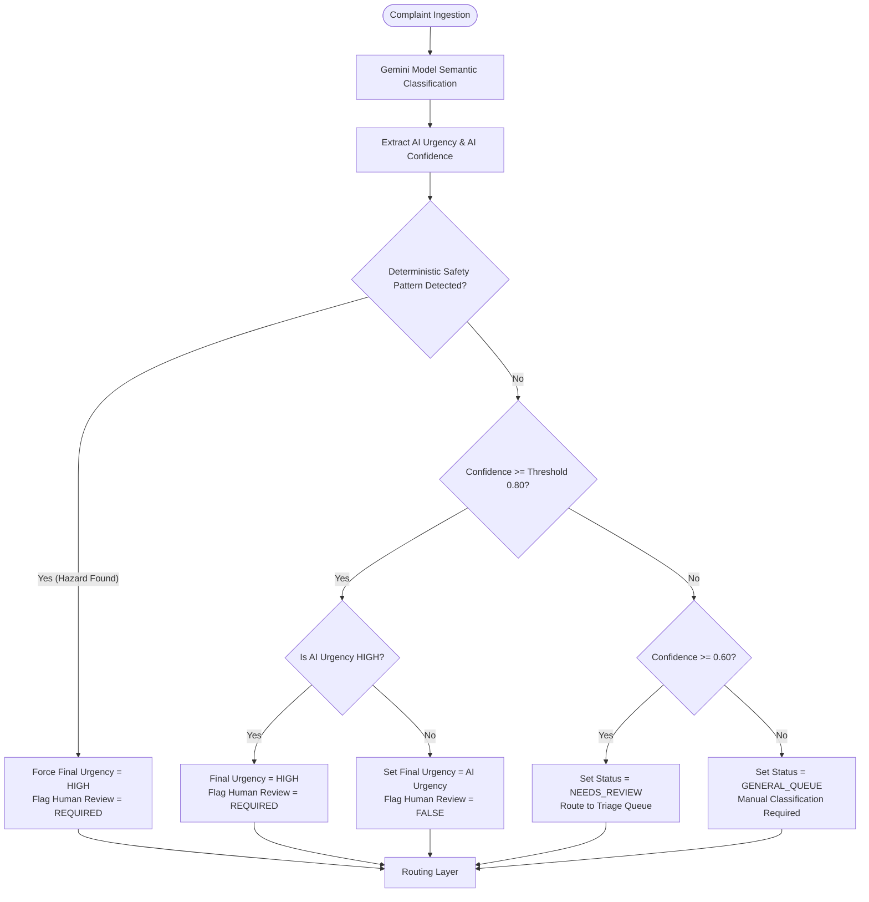
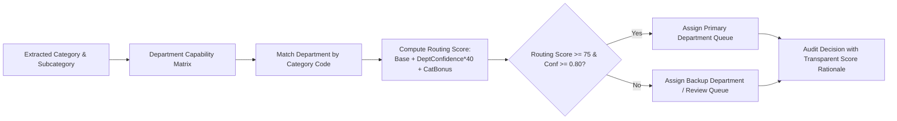
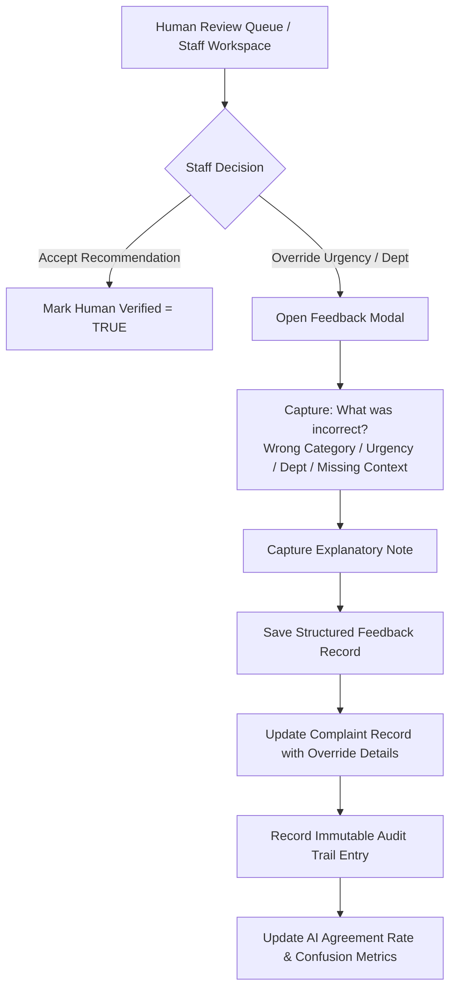
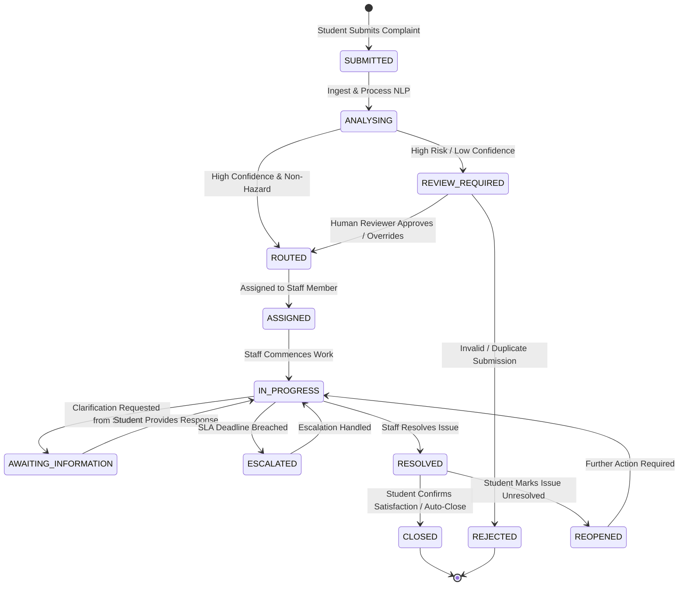
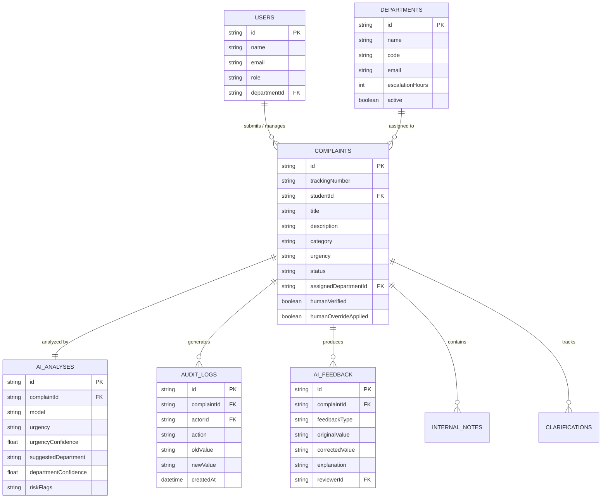
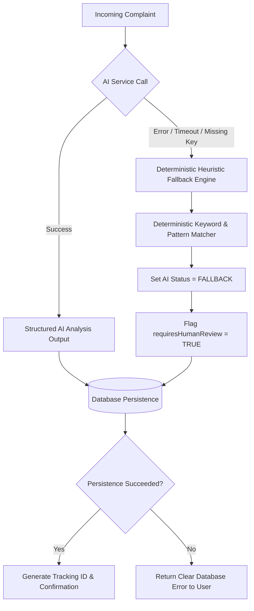

# Patent-Oriented Technical Description

## Title of the Technical Concept
**Computer-Implemented System and Method for Natural-Language Complaint Processing, Multi-Factor Hybrid Urgency Assessment, Confidence-Calibrated Automated Department Routing, and Human-in-the-Loop Feedback Optimization**

---

## A. Technical Field & Problem Statement

### Technical Field
This disclosure relates generally to institutional information systems, enterprise workflow routing, and decision-support engines, and more specifically to computer-implemented systems for ingesting unstructured natural-language complaints, extracting structured multi-dimensional facts and risk indicators, performing hybrid probabilistic-deterministic urgency assessment, executing confidence-bounded departmental dispatch, and capturing structured human corrections for continual evaluation.

### Technical Problem
Traditional complaint-management systems in educational institutions and enterprise environments suffer from several systemic technical shortcomings:
1. **Manual Triage Bottlenecks:** Human administrators must manually read, categorize, and forward high volumes of natural-language complaints. This causes delays, backlogs, and subjective variability in urgency assignment.
2. **Safety Hazard Blind Spots:** Critical safety hazards (e.g., exposed electrical wiring, structural collapse, gas leaks, harassment allegations) can sit unnoticed in standard ticket queues because probabilistic natural-language classifiers may assign low priority based on lexical nuances.
3. **Uncontrolled Generative AI Hallucinations:** Deploying unrestricted generative AI chatbots directly to end users risks hallucinated policies, invalid departmental assignments, and uncalibrated decisions without deterministic safety boundaries.
4. **Lack of Calibrated Confidence & Fallbacks:** Existing systems lack a formal mechanism to separate high-confidence automated routing from low-confidence cases that require human intervention.
5. **Absence of Structured Human-in-the-Loop Feedback Loops:** When human operators correct an erroneous routing or urgency decision, the correction is typically lost as an ad-hoc database update rather than preserved as a structured comparative dataset for model evaluation and iterative refinement.

---

## B. Proposed Technical Solution & Core Architecture

The present system provides a closed-loop, multi-stage, computer-implemented architecture that processes natural-language student complaints through structured semantic analysis, deterministic safety overrides, confidence-bounded routing, and human-verified audit logging.

```
STUDENT SUBMISSION (Natural Language Text + Structured Context)
  │
  ▼
[Text Validation & Privacy Sanitization]
  │
  ▼
[Server-Side NLP / Gemini AI Analysis Service]
  │── Extracts: Category, Subcategory, Entities, Risk Flags, Urgency, Confidence, Department
  ▼
[Deterministic Hybrid Rule Engine]
  │── Evaluates: High-Risk Safety Keywords, Regulatory Rules, Confidence Thresholds
  ▼
[Transparent Routing Engine & Scoring Mechanism]
  │── Computes: Department Capability Match, Location Context, Historical Score
  ▼
[Decision Gate: Human Review Required vs. Auto-Route]
  ├── If High-Risk, Low Confidence (<0.80), or Flagged ──► [Human Review Queue]
  └── If High Confidence & Non-Hazardous ──────────────► [Department Processing Queue]
                                                               │
                                                               ▼
                                                  [Human Override / Acceptance]
                                                               │
                                                               ▼
                                                  [Structured Feedback Capture]
                                                               │
                                                               ▼
                                                  [Audit Trail & Performance Metrics]
```

---

## C. Detailed Technical Pipeline

1. **Input Ingestion & Multilingual Normalization:**
   - Ingests raw complaint title and natural-language text.
   - Detects original language (e.g., English, Hindi, Hinglish).
   - Generates an internal normalized English semantic representation while preserving the unaltered student submission for display and auditability.
2. **Structured NLP Extraction:**
   - Invokes server-side AI model (`gemini-3.7-flash`) with strict schema constraints to produce structured JSON containing: summary, category, subcategory, urgency, urgency confidence ($0.0 \le c_u \le 1.0$), urgency reason, suggested department, department confidence ($0.0 \le c_d \le 1.0$), alternative department, risk flags, extracted entities (locations, dates, deadlines, equipment), and missing information markers.
3. **Deterministic Safety & Risk Override Layer:**
   - Executes deterministic regex and pattern-matching rules over the complaint body.
   - Evaluates high-risk keywords (e.g., exposed wiring, gas leak, fire, sexual harassment, violence, elevator entrapment).
   - If a safety pattern triggers, the system authoritatively elevates final urgency to `HIGH` regardless of probabilistic AI outputs.
4. **Confidence Thresholding & Triage:**
   - Evaluates composite confidence $C = \min(c_u, c_d)$.
   - If $C \ge \theta_{\text{high}}$ (e.g., $0.80$) and non-hazardous: Provisionally auto-routes to primary department.
   - If $\theta_{\text{med}} \le C < \theta_{\text{high}}$ (e.g., $0.60 \le C < 0.80$): Flags complaint as `NEEDS_REVIEW`.
   - If $C < \theta_{\text{med}}$ (e.g., $< 0.60$): Routes to `GENERAL_REVIEW_QUEUE`.
5. **Department Capability Routing Score:**
   - Calculates a transparent routing score:
     $$\text{Routing Score} = S_{\text{base}} + (c_d \times W_{\text{conf}}) + S_{\text{cat\_match}}$$
6. **Human-in-the-Loop Review & Feedback Capture:**
   - When an authorized staff member or administrator approves or overrides an AI suggestion, the system records:
     $$\text{Feedback} = \langle \text{ComplaintId}, \text{AISuggestion}, \text{HumanCorrection}, \text{Reason}, \text{ReviewerId}, t \rangle$$
   - Stores corrections in a dedicated feedback repository for model evaluation and audit tracking.

---

## D. Technical Figures (Mermaid Representations)

### Figure 1: Overall System Architecture


### Figure 2: Complaint Processing Pipeline


### Figure 3: AI Urgency and Confidence Decision Workflow


### Figure 4: Department Routing Mechanism


### Figure 5: Human-in-the-Loop Correction and Feedback Loop


### Figure 6: Complaint Lifecycle State Machine


### Figure 7: Database & Data Relationship Diagram


### Figure 8: Failure & Fallback Mechanism


---

## E. State Transition & Safety Guarantees

1. **No Data Loss Guarantee:** If external AI services fail or timeout, the system executes an internal deterministic heuristic fallback engine and guarantees the complaint is securely stored in a human review queue.
2. **Safety Shielding Principle:** Probabilistic machine learning model output is strictly subordinate to deterministic institutional safety rules. If any safety pattern is matched, the final urgency is enforced as `HIGH` with human review mandatory.
3. **Student Privacy Isolation:** Confidential internal staff notes, private administrative audit trails, and raw model confidence calculations are isolated on the server side and never sent to student endpoints.
4. **Structured Feedback Preservation:** Overrides are stored as structured tuples rather than free-form text, enabling quantitative tracking of human agreement rates and model performance.

*Disclaimer: This document is provided to preserve technical conception and system interactions for review by qualified patent professionals.*
